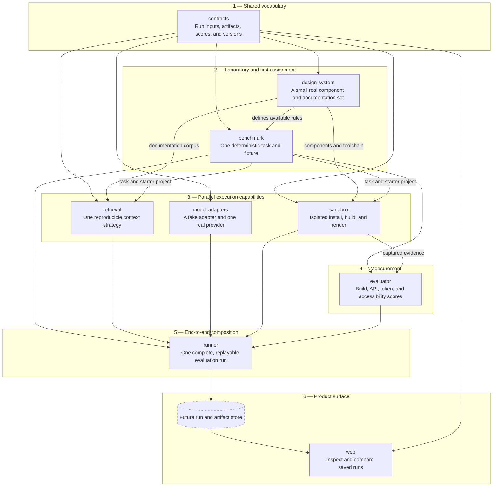

# Architecture

## Design principles

1. **Reproducible inputs.** A run identifies immutable task, design-system, context-strategy,
   model-adapter, and evaluator versions.
2. **Captured evidence.** Scores point to durable artifacts such as source, build logs,
   accessibility reports, interaction traces, and screenshots.
3. **Replaceable infrastructure.** Provider SDKs, retrieval engines, renderers, and scoring tools
   sit behind narrow interfaces.
4. **No privileged model path.** Every compared model receives equivalent task inputs and an
   explicitly recorded context bundle.
5. **Untrusted output.** Generated code crosses a hard trust boundary before build or execution.

## Data flow

```text
benchmark task + design-system release
                  |
                  v
          retrieval/context bundle
                  |
                  v
             model adapter
                  |
                  v
        generated source artifact
                  |
                  v
        isolated sandbox execution
                  |
                  v
  build + render + a11y + interaction artifacts
                  |
                  v
        evaluators and aggregation
                  |
                  v
       result record and public views
```

## Package ownership

| Workspace | Owns | Must not own |
| --- | --- | --- |
| `contracts` | shared value types and stable identifiers | provider SDKs or execution logic |
| `design-system` | tokens, components, docs, usage rules, fixtures | benchmark scoring |
| `benchmark` | task manifests, suites, fixture resolution | model invocation |
| `retrieval` | deterministic context assembly and provenance | prompt execution |
| `model-adapters` | normalized model invocation and usage metadata | benchmark policy |
| `sandbox` | untrusted build/render/interaction execution | score interpretation |
| `evaluator` | dimension scorers, evidence, and aggregation | provider-specific behavior |
| `runner` | orchestration and run lifecycle | reusable domain behavior |
| `web` | playground, inspection, comparison, leaderboard views | authoritative scoring |

## Dependency rule

`contracts` is the shared base. Feature packages may depend on it but should not depend on each
other by default. The runner composes concrete implementations. This keeps evaluators usable
against previously captured artifacts and prevents the model layer from reaching into the
sandbox or scoring layer.

## Recommended delivery order

This is a delivery dependency map, not a requirement to finish an entire package before starting
another. Each phase should produce the smallest useful slice needed by the next phase. In
particular, the design system and benchmark should grow together rather than attempting to complete
the full laboratory before testing one task.



The critical path is therefore:

1. Establish the minimum shared contracts.
2. Build enough of the design system to support one representative benchmark task.
3. Develop retrieval, model invocation, and sandbox execution in parallel against that task.
4. Score the artifacts produced by the sandbox.
5. Compose those capabilities into one replayable runner flow.
6. Add durable run storage, then expose saved results through the web application.

After the first vertical slice works, expand task coverage, design-system depth, providers,
retrieval strategies, and evaluators iteratively. This sequence avoids building broad subsystems
against assumptions that have not yet survived a real run.

## Deliberately deferred decisions

- frontend framework and application router
- database and artifact-store providers
- queue and worker topology
- container, VM, or remote sandbox implementation
- runtime schema-validation library
- model SDKs and tracing backend
- scoring weights and leaderboard aggregation policy

Each should be chosen with an ADR once a thin end-to-end benchmark slice makes the tradeoff
concrete.
